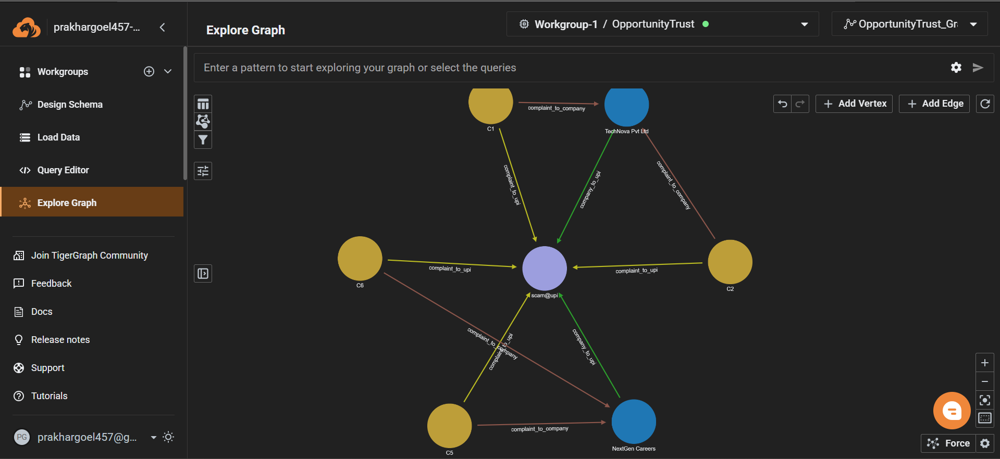
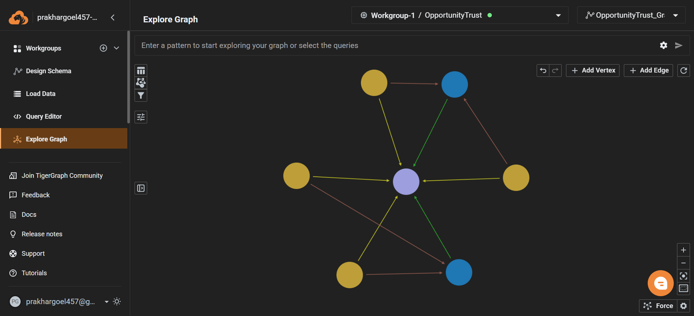
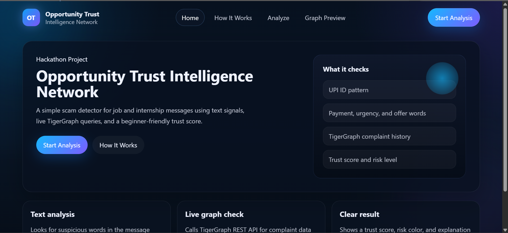
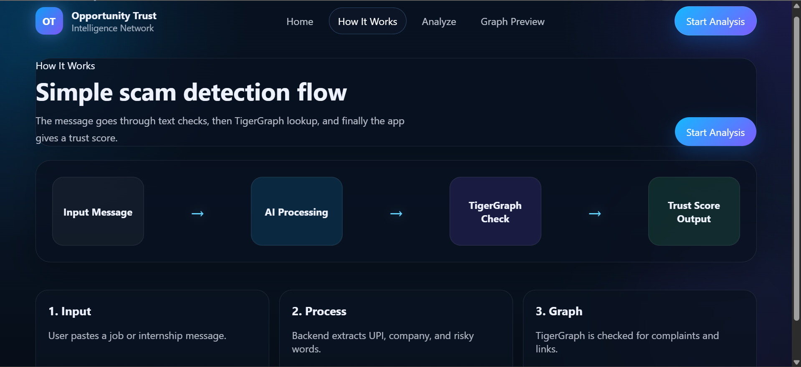
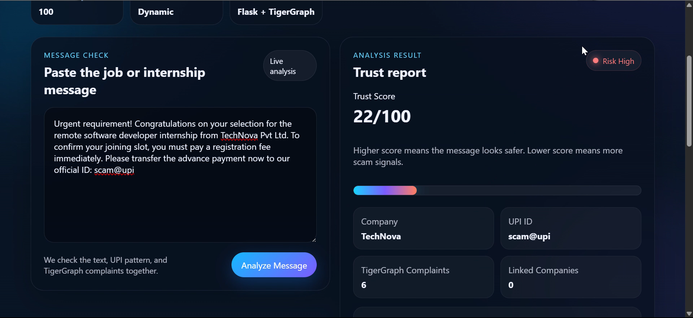
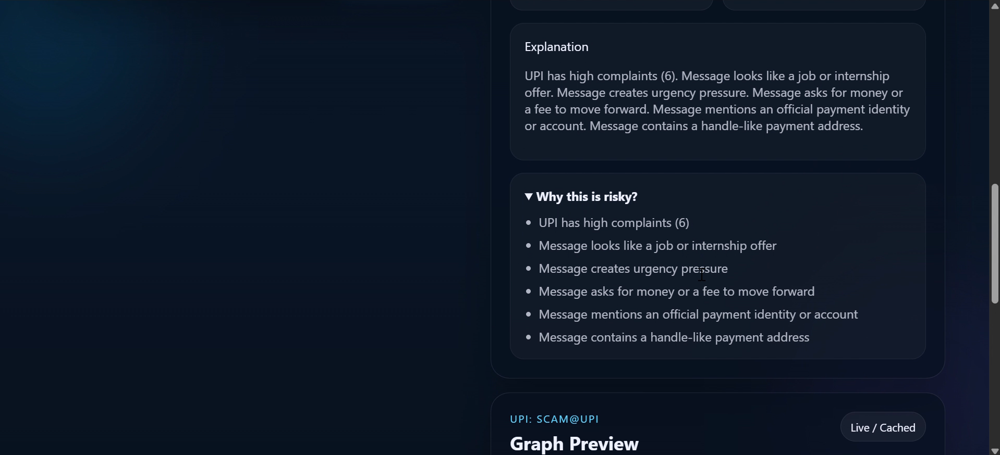
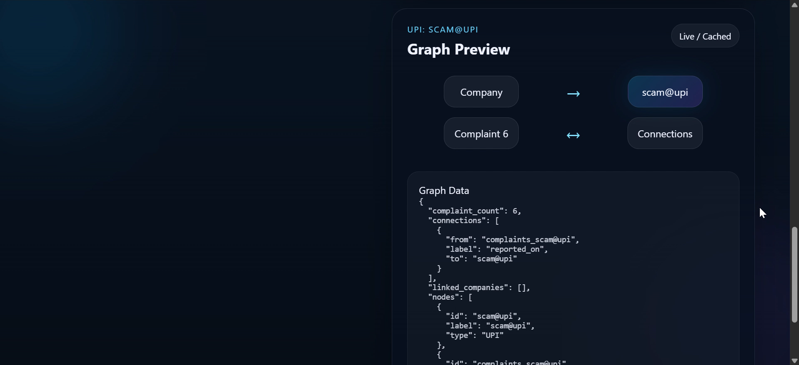
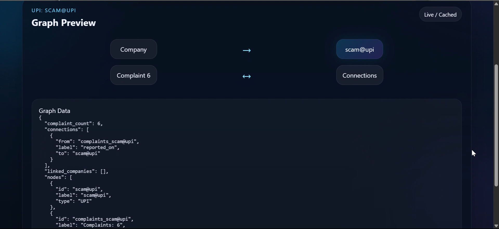
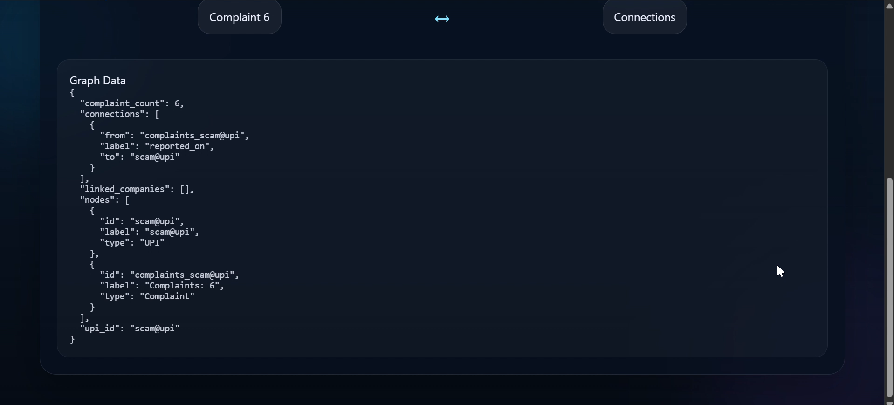

# 🧠 Opportunity Trust Intelligence Network

### A smart helper that reads suspicious job messages and warns you before you lose money.

---

## 👋 Hello! What is this project?
Imagine your friend gets a message like this:

"Congratulations! You got selected for an internship. Pay a registration fee now."

It sounds exciting, but it may be a scam.

This project helps people check such messages quickly. It gives a **Trust Score** from 0 to 100:
- **Higher score** = message looks safer
- **Lower score** = message looks risky

---

## 🚨 Problem Statement
Today many students and job seekers receive fake messages like:
- "Pay fee now to confirm interview"
- "Send money to this UPI to join internship"
- "Urgent! Last chance!"

These scams can:
- steal money
- steal personal details
- waste time and confidence

Many people, especially beginners, cannot easily identify these fake messages.

So the real problem is:
**How can we quickly detect scam-like job/internship messages in a simple way?**

---

## 💡 Solution (Our Idea)
We built a simple web app where a user:
1. pastes a suspicious message
2. clicks analyze
3. sees a trust score, risk level, and explanation
4. sees graph-based complaint connection data from TigerGraph

In very simple words:
- We check risky words in text
- We detect UPI IDs
- We check complaint links from a graph database
- We combine all clues and generate a final score

This makes scam detection easier even for a beginner.

---

## 🎯 Key Features
- **Simple message input**
: Paste any job/internship text and analyze instantly.

- **Trust Score (0-100)**
: Easy number that tells how safe or risky a message looks.

- **Risk label (Low / Medium / High)**
: Quick decision help for non-technical users.

- **UPI extraction**
: Detects UPI IDs like `name@upi` directly from text.

- **TigerGraph complaint check**
: Checks if that UPI is connected with complaint records.

- **Visual graph preview**
: Shows node connections so users can understand risk relationships.

- **Beginner-friendly UI**
: Clean pages for Home, How It Works, Analyze, and Graph Preview.

---

## 🖼️ Screenshots

### Figure 1: TigerGraph full network (with labels)


This screen shows the raw graph in TigerGraph with visible edge labels like `complaint_to_upi` and `complaint_to_company`.

What this reveals:
- One UPI node (`scam@upi`) can be connected to many complaint nodes.
- The same UPI can also be linked with multiple company names.
- This is the relationship data used by backend scoring.

### Figure 2: TigerGraph clean network view


This is a cleaner visual of the same graph pattern without cluttered text.

What this reveals:
- The project is not only keyword-based; it uses graph relationships too.
- Central UPI node with many incoming complaint links means higher risk.

### Figure 3: Landing page (Home)


This is the first page users see.

What this reveals:
- Project branding and purpose are clear.
- Main checks are shown: UPI pattern, risky words, TigerGraph complaint history, trust score.
- Call-to-action buttons help users quickly start analysis.

### Figure 4: How It Works workflow page


This page explains the full pipeline in one flow.

What this reveals:
- Four easy stages: Input Message -> AI Processing -> TigerGraph Check -> Trust Score Output.
- The system is designed for beginners who want explainable logic.

### Figure 5: Analyze page with live result


This screen shows a real suspicious message being analyzed.

What this reveals:
- Trust Score is `22/100`, marked as `Risk High`.
- Extracted entities are shown (Company and UPI ID).
- TigerGraph complaint count is included directly in result.

### Figure 6: Explanation and risk bullets


This section explains *why* the message is risky.

What this reveals:
- Model output is transparent and explainable.
- Users can see exact signals: high complaints, urgency words, money request, official identity claim, handle-like address.

### Figure 7: Graph preview summary card


This graph card converts backend JSON into a quick visual summary.

What this reveals:
- UPI is the center node.
- Complaint count and relation direction are shown.
- Data is tagged as `Live / Cached` for clarity.

### Figure 8: Graph preview detailed layout


This is a wider view of graph preview and JSON block together.

What this reveals:
- The app provides both visual graph hints and raw structured data.
- Users can inspect exact backend response for trust and debugging.

### Figure 9: Raw Graph Data JSON panel


This close-up shows the graph JSON payload.

What this reveals:
- Node types used by the project: `UPI`, `Complaint`.
- Connection labels used by the project: `reported_on`.
- This proves the frontend is reading real graph response fields, not fake placeholders.

---

## 🏗️ How It Works (Step-by-Step)

### Step 1: User inputs message
The user pastes a suspicious job or internship message.

Example:
"Urgent! Pay registration fee now to confirm internship slot."

### Step 2: AI-like text processing
Backend checks risky clues such as:
- urgency words (urgent, now, immediately)
- payment words (fee, deposit, transfer)
- suspicious offer patterns
- UPI handles

### Step 3: Graph relationship check
If a UPI is found, backend asks TigerGraph:
- How many complaints are linked to this UPI?
- Which companies are connected with this UPI?

### Step 4: Trust score generation
All signals are combined.
Then app shows:
- Trust Score
- Risk Level
- Explanation bullets
- Graph Preview

---

## 🧩 System Architecture

### Components in simple words
- **Frontend (React + Vite)**
: What user sees and clicks.

- **Backend (Flask API)**
: Brain of the app, receives message and calculates score.

- **AI logic (Rule-based scoring)**
: Detects suspicious patterns from text.

- **Graph Database (TigerGraph)**
: Stores complaint links between UPI and company nodes.

### Architecture Diagram (Simple)
```text
User Message
    |
    v
Frontend (React)
    |
    v
Backend API (Flask)
    |            \
    |             \--> Text Risk Analyzer (rules)
    |
    +--> TigerGraph Query (complaints + links)
                    |
                    v
         Combined Trust Score + Explanation
                    |
                    v
           UI Result + Graph Preview
```

---

## 📊 Graph Explanation (VERY IMPORTANT)
Think of graph like a **social network**, but for scam signals.

### Node types
- **Company node**
: A company name appearing in suspicious messages.

- **UPI node**
: Payment handle used in messages, like `scam@upi`.

- **Complaint node**
: A complaint record raised by victims.

### Edge (connection) meaning
- **Complaint -> UPI**
: This UPI was reported in a complaint.

- **Complaint -> Company**
: This company name appeared in that complaint.

- **Company -> UPI (derived/linked)**
: The app can show possible relation if found in graph response.

### Easy analogy
Like Instagram friends graph:
- people are nodes
- follows are edges

Here:
- company / upi / complaint are nodes
- suspicious links are edges

More links + more complaints = more risk.

---

## 🛠️ Tech Stack
- **React**
: Builds webpage screens.

- **Vite**
: Runs React fast during development.

- **Flask (Python)**
: Backend API server.

- **Python regex + logic rules**
: Finds UPI and suspicious patterns.

- **TigerGraph**
: Graph database for relationship checks.

- **REST API**
: Backend talks to TigerGraph using HTTP calls.

- **CSS**
: Styling for dark modern UI.

---

## ⚙️ Installation Guide (VERY SIMPLE)

## 0) Things you need first
- Python installed
- Node.js installed
- Git installed

## 1) Clone the project
```powershell
git clone <your-repo-url>
cd "Opportunity Trust"
```

## 2) Backend setup
```powershell
cd backend
python -m venv venv
venv\Scripts\activate
pip install -r requirements.txt
```

Create `.env` file inside `backend/` using this template:
```env
TIGERGRAPH_HOST=https://<your-tigergraph-host>
TIGERGRAPH_GRAPH_NAME=OpportunityTrust_Graph
TIGERGRAPH_TOKEN=<your-token>
TIGERGRAPH_QUERY_NAME=find_complaints_by_upi
TG_UPI_PARAM_NAME=input_upi
```

Run backend:
```powershell
python app.py
```
Backend starts at: `http://127.0.0.1:5000`

## 3) Frontend setup
Open a new terminal:
```powershell
cd frontend
npm install
npm run dev
```
Frontend starts at: `http://localhost:5173`

## 4) Use app
- Open browser at frontend URL
- Go to Analyze page
- Paste message
- Click Analyze Message

---

## 🧪 Example Inputs & Outputs

### Example 1 (High Risk)
**Input**
```text
Urgent requirement! Congratulations on your selection for internship.
Pay registration fee immediately to scam@upi.
```

**Expected Output (approx)**
- Trust Score: 10-30
- Risk: High
- Reason: urgency + money request + suspicious UPI

### Example 2 (Medium Risk)
**Input**
```text
SkillGrow training program. Refundable deposit required to begin.
Send it to fake@upi.
```

**Expected Output (approx)**
- Trust Score: 40-55
- Risk: Medium/High boundary
- Reason: deposit + payment handle + scam-like onboarding

### Example 3 (Safer Message)
**Input**
```text
We are hiring interns. Apply through official careers portal.
No payment is required.
```

**Expected Output (approx)**
- Trust Score: 75-95
- Risk: Low
- Reason: no payment demand, normal hiring flow

---

## 🚀 Future Improvements
- Add real NLP/LLM model for smarter language understanding
- Real-time complaint feed integration
- Multi-language scam detection (Hindi + English + regional)
- One-click report button for suspicious messages
- Auto-learning from user feedback
- Stronger visual graph with interactive nodes and filters

---

## 🏆 Why This Project is Powerful
- Protects students and freshers from fake internships
- Converts confusing text into simple risk score
- Uses graph intelligence, not only keyword matching
- Beginner-friendly design makes cybersecurity awareness easy
- Can be expanded into a real public safety product

In one line:
**This project turns scam confusion into clear action.**

---

## 🙌 Team / Credits
Built as a hackathon project by the Opportunity Trust team.

Special thanks:
- TigerGraph platform for graph infrastructure
- Open-source ecosystem (React, Flask, Python)

---

## 📁 Project Structure (Quick View)
```text
Opportunity Trust/
├── backend/
│   ├── app.py
│   ├── logic.py
│   ├── tigergraph.py
│   ├── utils.py
│   ├── requirements.txt
│   └── .env.example
├── frontend/
│   ├── src/
│   ├── package.json
│   └── vite.config.js
├── README.md
├── LICENSE
└── .gitignore
```

---

## ✅ License
This project uses the MIT License.
See the `LICENSE` file for details.
